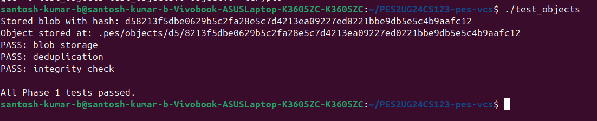
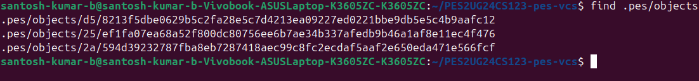
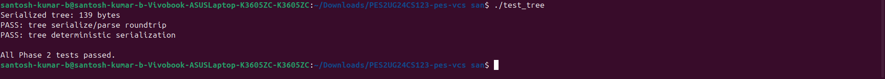
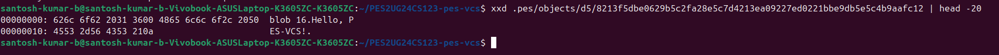
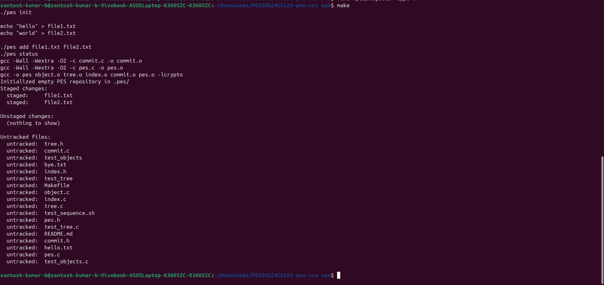
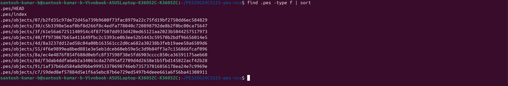
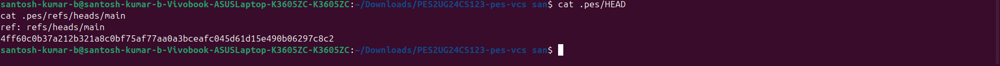

# PES-VCS – Version Control System Lab

**Student:** Santosh Kumar B  
**SRN:** PES2UG24CS123  
**Repository:** [GitHub Link](https://github.com/SantoshKumarBollavaram/PES2UG24CS123-pes-vcs)

---

## 📸 Screenshots

### Phase 1: Object Storage Foundation
| ID | Description | Screenshot |
|----|-------------|------------|
| 1A | `./test_objects` output |  |
| 1B | `find .pes/objects` sharded structure |  |

### Phase 2: Tree Objects
| ID | Description | Screenshot |
|----|-------------|------------|
| 2A | `./test_tree` output |  |
| 2B | `xxd` of a raw tree object |  |

### Phase 3: The Index (Staging Area)
| ID | Description | Screenshot |
|----|-------------|------------|
| 3A | `./pes status` output |  |
| 3B | `cat .pes/index` contents |  |

### Phase 4: Commits and History
| ID | Description | Screenshot |
|----|-------------|------------|
| 4A | `./pes log` output |  |
| 4B | `find .pes -type f \| sort` object growth |  |
| 4C | `cat .pes/refs/heads/main` and `cat .pes/HEAD` |  |

---

## 📝 Analysis Questions

### Q5.1 – Branching and Checkout

**How to implement `pes checkout <branch>`:**

1. **Read the target branch reference:** Open `.pes/refs/heads/<branch>` to obtain the commit hash.  
2. **Read the commit object:** Use `object_read()` on that hash to retrieve commit metadata, including the root tree hash.  
3. **Recursively traverse the tree:** Read the tree object and all its subtrees to build a complete file list (path → blob hash + mode).  
4. **Update the working directory:**  
   - For each file in the target tree, write the blob contents (from `object_read`) to the corresponding working directory path, setting correct permissions.  
   - Remove files that exist in the working directory but are not in the target tree (if they are tracked).  
5. **Update HEAD:** Write `ref: refs/heads/<branch>` to `.pes/HEAD`. For a detached HEAD (checkout by commit hash), write the commit hash directly.  
6. **Update the index:** Replace `.pes/index` with entries from the target tree so that subsequent `pes status` reflects the new state.

**Complexities:**  
- **Conflict detection:** Must verify that no uncommitted changes would be overwritten (see Q5.2).  
- **Performance:** Writing many files can be slow; caching blob reads helps.  
- **Atomicity:** Use temporary directories and rename operations to avoid leaving the working directory in a half‑updated state if interrupted.

---

### Q5.2 – Detecting a Dirty Working Directory

To detect conflicts when switching branches:

1. **Identify files with unstaged changes:**  
   - For each entry in the index, `stat()` the corresponding working file.  
   - Compare `st_mtime` and `st_size` with the index metadata. If they differ, the file is modified.  
   - A more accurate (but slower) method is to recompute the blob hash of the working file and compare it with the hash in the index.  

2. **Identify files that differ between the current HEAD and the target branch:**  
   - Recursively compare the tree of the current commit (from HEAD) with the tree of the target commit.  
   - For each path present in both trees, if the blob hashes differ, that file has changed between commits.  

3. **Conflict condition:**  
   - If a file is **both** modified in the working directory **and** different between the two commits, checkout must abort with an error message.  

This ensures that local work is never silently overwritten.

---

### Q5.3 – Detached HEAD and Commit Recovery

**Detached HEAD state:**  
- `.pes/HEAD` contains a raw commit hash instead of a branch reference (e.g., `ref: refs/heads/main`).  
- Commits made in this state create new commit objects whose parent is the current HEAD commit.  
- The new commit hash is written directly to `.pes/HEAD`; no branch is updated.  

**Recovering commits:**  
- The commit objects still exist in `.pes/objects` and are reachable by their hash.  
- To recover, the user can:  
  1. Find the hash of the desired commit (from terminal history or by inspecting object timestamps).  
  2. Create a new branch pointing to that hash:  
     ```bash
     echo "<commit-hash>" > .pes/refs/heads/recovery-branch
